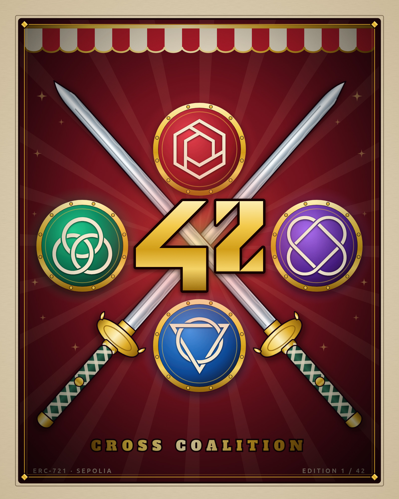

# The NFT artwork — *Cross Coalition*



| | |
|---|---|
| **File to pin** | `42berry-cross-coalition.jpg` — 1600 × 2000 px, RGB, 620 KB |
| **Vector source** | `42berry-cross-coalition.svg` — self-contained, no external assets |
| **Generator** | `generate.py` |

## The concept

The piece is a homage to the *Cross Guild* poster from One Piece, rebuilt around 42.

Two crossed katana form the **X** of the composition. Where the blades meet sits the
**42 emblem** — the official 42 logo, rendered large, unrotated and unobstructed so the
number is impossible to misread. The four wedges the cross carves out of the poster are
filled by the four coalitions of 42 Paris, each set in a gilded medallion in its own
colour:

| Wedge | Coalition |
|---|---|
| Top | The Order |
| Left | The Alliance |
| Right | The Assembly |
| Bottom | The Federation |

The original poster puts a character in three of those four slots and a jolly roger in
the fourth. Using all four coalitions instead of three keeps the composition symmetrical
around the 42 and leaves no coalition out. The emblems are left unlabelled — they are
recognisable on their own, and the poster reads as a crest rather than a billboard.

The rest of the styling carries the circus-poster language of the source: a big-top
valance, a red sunburst behind the cross, and aged parchment inside a gold keyline.
The only lettering is the *Cross Coalition* caption and a small technical footer.

## Constraints from the subject, and how they are met

- **The number 42 must be included and correctly displayed.** The centrepiece is the
  official 42 logo (from [Wikimedia Commons](https://commons.wikimedia.org/wiki/File:42_Logo.svg)),
  drawn at true aspect ratio with no rotation, skew or occlusion. It is the largest element
  on the poster. `42` also appears in the edition mark (*EDITION 1 / 42*, matching
  `MAX_SUPPLY = 42` in the contract).
- **No insulting terms or images.** The artwork contains only the 42 logo, the four
  coalition emblems, and decorative elements.
- **Stored on distributed registry technology.** See *Pinning to IPFS* below.
- **Metadata.** `metadata.json` is the ERC-721 descriptor. The `name` includes both `42`
  and a title, and the artist field carries the 42 login.

## Pinning to IPFS

Two files go on IPFS, in this order: the JPEG first, because the metadata has to name the
image's CID, and the metadata second, because its own CID has to cover that edit. Pinning
them the other way round produces a descriptor that points at nothing.

`pin.sh` drives the whole sequence. With a [Pinata](https://pinata.cloud) API key:

```bash
export PINATA_JWT=...          # Pinata dashboard -> API Keys -> New Key
./image/pin.sh upload
```

Or, if the files are uploaded by hand through any pinning service's web UI:

```bash
./image/pin.sh set-image <image CID>          # then upload the edited metadata.json
./image/pin.sh record <image CID> <metadata CID>
```

Either path writes both CIDs to `deployment/ipfs.json` and fills them into the table in
`deployment/README.md`. Confirm the pins are actually reachable from outside this machine
before minting — this also checks that the pinned JSON points at the pinned image:

```bash
./image/pin.sh check
```

Then mint with the metadata URI:

```
mint(<recipient address>, "ipfs://<metadata CID>")
```

Token identifiers start at 1, so `tokenURI(1)` resolves to the JSON for the first artwork,
which in turn points at the image.

## Regenerating the artwork

```bash
python3 image/generate.py
```

That rewrites the SVG. Rasterising it is two steps — headless Chrome always screenshots to
PNG, so the PNG is an intermediate that gets converted to the JPEG that actually ships:

```bash
# 1. SVG -> PNG (any SVG renderer works; headless Chrome needs no extra dependencies)
google-chrome --headless=new --disable-gpu --hide-scrollbars \
  --screenshot=/tmp/out.png --window-size=1600,2000 \
  file://$PWD/image/42berry-cross-coalition.svg

# 2. PNG -> JPEG, the file that is pinned
python3 -c "from PIL import Image; \
Image.open('/tmp/out.png').convert('RGB').save( \
'image/42berry-cross-coalition.jpg','JPEG', \
quality=92, subsampling=0, optimize=True, progressive=True)"
```

### Why JPEG and not PNG

The poster contains ~227,000 distinct colours — gradient sunburst, gilded medallions,
metallic blades. PNG compresses flat colour, so the lossless render is 3.5 MB, which is
slow to load through public IPFS gateways. The two ways to shrink it compare as follows,
measured as RMSE against the lossless render:

| Variant | Size | RMSE |
|---|---|---|
| Lossless PNG | 3.53 MB | 0.00 |
| PNG, 256-colour adaptive palette | 0.85 MB | 4.99 |
| **JPEG q92, 4:4:4 chroma** | **0.62 MB** | **1.87** |

Quantising to a palette is worse on both axes — larger *and* nearly three times the
error, with the error concentrated as visible banding across the smooth red sunburst.
JPEG at q92 is smaller and far more faithful.

`subsampling=0` is deliberate. JPEG by default halves colour resolution, which smears
saturated edges — exactly the gold-on-crimson 42 that the subject requires to be legible.
Disabling it costs a few KB and removes the risk entirely.

## Credits

- 42 logo — 42 School.
- Coalition emblems — official artwork from the 42 intra CDN (`cdn.intra.42.fr/coalition/image/…`).
- Display typeface — [Alfa Slab One](https://fonts.google.com/specimen/Alfa+Slab+One) by
  JM Solé, SIL Open Font License 1.1. Embedded in the SVG as a base64 `@font-face`, which
  the OFL permits; `AlfaSlabOne-Regular.ttf` is kept alongside for regeneration.
- Composition inspired by the *Cross Guild* poster from *One Piece* (Eiichiro Oda /
  Toei Animation). No source pixels are used — every element here is drawn from scratch
  or is official 42 artwork.
